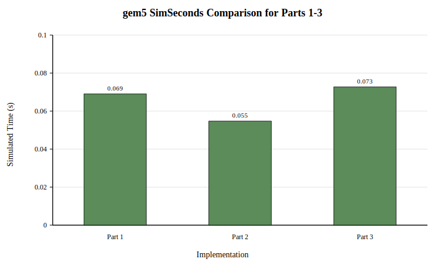
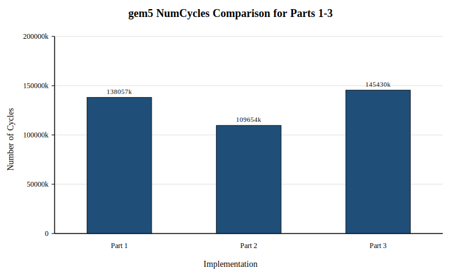
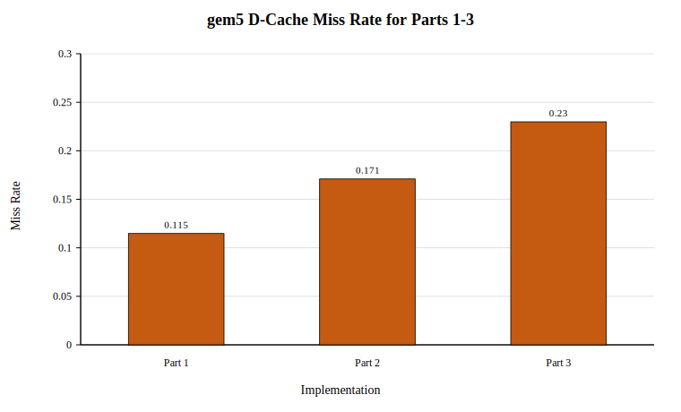
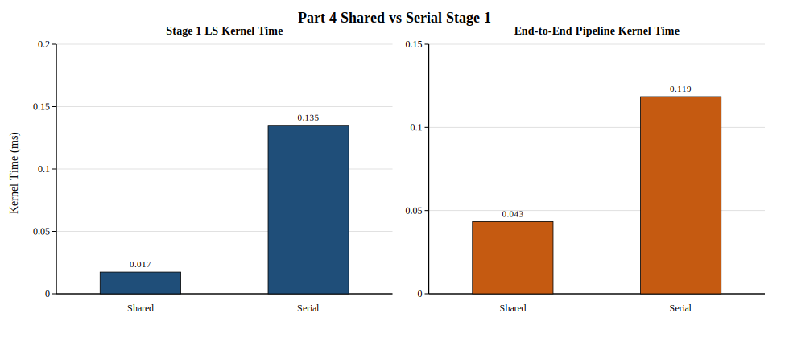
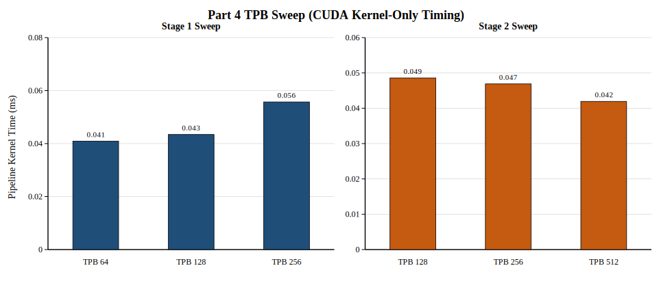
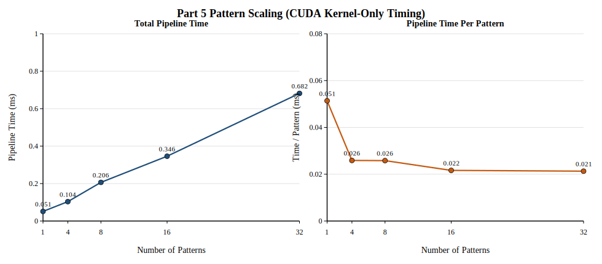

# CA Final Project Report

## 1. 環境

本專題的主題為：

```text
LS Channel Estimation + LMMSE/MMSE Equalizer Acceleration
```

實作比較五種不同的平行化模型：

| Part | 主要平台 | Stage 1 | Stage 2 |
| --- | --- | --- | --- |
| Part 1 | Scalar RISC-V | Scalar LS channel estimation | Scalar LMMSE equalization |
| Part 2 | RVV | RVV reduction LS channel estimation | RVV LMMSE equalization |
| Part 3 | RVV | SIMD-like RVV LS channel estimation | RVV LMMSE equalization |
| Part 4 | CUDA GPU | CUDA shared-memory LS reduction | CUDA LMMSE equalization |
| Part 5 | CUDA GPU | Multi-pattern CUDA LS reduction | Multi-pattern CUDA LMMSE equalization |

實驗環境分成兩類：

### gem5 / RISC-V 環境

- Cross compiler：`riscv64-linux-gnu-g++`
- 模擬器：`gem5`
- CPU model：`TimingSimpleCPU`
- Memory：`256 MB`
- L1 I-cache：`32 kB`, 8-way
- L1 D-cache：`32 kB`, 8-way
- Cache line：`32 bytes`

### CUDA 環境

- GPU：`NVIDIA GeForce RTX 3060`
- Compute Capability：`8.6`
- Compiler：`nvcc 12.4`
- CUDA build target：`-arch=sm_86`
- Profiling tool：`Nsight Compute (ncu --set basic)`

主要編譯設定如下：

| 範圍 | 主要編譯設定 |
| --- | --- |
| Part 1 | `riscv64-linux-gnu-g++ -static -O2 -std=c++11` |
| Part 2 / Part 3 | `riscv64-linux-gnu-g++ -static -O2 -std=c++11 -march=rv64gcv -mabi=lp64d` |
| Part 4 / Part 5 | `nvcc -O2 -std=c++17 -arch=sm_86 -lineinfo -Xptxas -v` |

題目在 [reference/CA_Final_Project.pdf](/home/york/ca_final_project/reference/CA_Final_Project.pdf) 中提醒：

1. GPU 型號需要註明。
2. `gem5 simulated time` 與實際 CPU/GPU runtime 是不同概念，不可直接混用。
3. 運算結果必須輸出或參與後續驗證，避免被 compiler 移除。
4. 報告不能只有數據，必須解釋 performance behavior。

本報告遵循這些原則：

- Part 1～3 使用 gem5 simulated statistics。
- Part 4～5 使用 `cudaEvent` 量測的 GPU kernel-only timing。
- 兩類數據分開整理，不直接把 `simSeconds` 與 GPU kernel time 放在同一張快慢比較表中。

## 2. 檔案說明

本 repository 的主要結構如下：

| 路徑 | 內容 |
| --- | --- |
| `common/` | 共用參數、資料陣列、I/O、模型與驗證函式 |
| `data_gen/` | 單一 pattern OFDM 輸入產生器 |
| `data/` | 產生出的 binary input |
| `part1/` | Scalar baseline |
| `part2/` | RVV reduction implementation |
| `part3/` | SIMD-like RVV implementation |
| `part4/` | Single-pattern CUDA SIMT implementation |
| `part5/` | Multi-pattern CUDA implementation |
| `figures/` | 報告圖表 |
| `reference/` | 作業 PDF、RVV spec 與助教參考資料 |

與實驗直接相關的主要檔案如下：

| 檔案 | 用途 |
| --- | --- |
| `data_gen/generate_ofdm_data.cpp` | 產生 `data/ofdm_input.bin` |
| `part5/generate_ofdm_multi.cpp` | 產生 `data/ofdm_input_multi.bin` |
| `part1/main.cpp` | Part 1 scalar baseline |
| `part2/main.cpp` | Part 2 RVV reduction + RVV LMMSE |
| `part3/main.cpp` | Part 3 SIMD-like RVV + RVV LMMSE |
| `part4/main.cu` | Part 4 CUDA single-pattern implementation |
| `part5/main.cu` | Part 5 CUDA multi-pattern implementation |
| `part5/main_cpu.cpp` | Part 5 CPU baseline |
| `part1/part2/part3/Makefile` | gem5 / RISC-V build and run flow |
| `part4/Makefile` | CUDA build, PTX, NCU, sweep |
| `part5/Makefile` | Multi-pattern CUDA build, PTX, NCU, CPU baseline, sweep |

## 3. 演算法內容

### 3.1 OFDM workload

本專題實作的是 pilot-based OFDM receiver pipeline，包含兩段主要計算：

1. `LS channel estimation`
2. `one-tap LMMSE equalization`

固定參數如下：

| Parameter | Value | 說明 |
| --- | --- | --- |
| `NUM_SUBCARRIERS` | `512` | frequency-domain subcarriers |
| `NUM_PILOTS` | `256` | 每個 subcarrier 的 repeated pilot observations |
| `NUM_DATA_SYMBOLS` | `512` | OFDM data symbols |
| `TOTAL_PILOT` | `131072` | `512 x 256` complex pilot samples |
| `TOTAL_DATA` | `262144` | `512 x 512` complex equalization outputs |
| Modulation | `QPSK` | `±1 ± j1` |
| `SYMBOL_POWER` | `2` | QPSK symbol power |
| `NOISE_STD` | `0.0404` | AWGN 每個 real dimension 的標準差 |

資料布局由程式固定為：

```text
pilot_index(k, p) = k * NUM_PILOTS + p
data_index(s, k)  = s * NUM_SUBCARRIERS + k
```

這個布局的意義是：

- 固定 `k`、沿 `p` 掃描時，pilot data 是 contiguous。
- 固定 `p`、跨不同 `k` 掃描時，stride 為 `NUM_PILOTS * sizeof(float) = 1024 bytes`。

這個差異直接影響 Part 2 與 Part 3 的 mapping：

- Part 2 適合沿 `p` 做 unit-stride vector reduction。
- Part 3 若讓 lane 對應不同 `k`，就必須承擔 `vlse32.v` 的 strided access。

### 3.2 數學模型

Pilot symbols 固定為：

```text
X_pilot[k,p] = 1 + j0
```

Received pilot model：

```text
Y_pilot[k,p] = H[k] + N_pilot[k,p]
```

LS channel estimation：

```text
Hhat[k] = sum_{p=0}^{P-1} Y_pilot[k,p] * w[p]
w[p] = 1 / P
```

拆成 real / imaginary arrays：

```text
Hhat_r[k] = sum_p Ypilot_r[k,p] * w[p]
Hhat_i[k] = sum_p Ypilot_i[k,p] * w[p]
```

這一段就是題目在 Part 1 / Part 2 指定的 nested-loop summation form：

```text
f(a1, b1) + f(a2, b2) + ... + f(an, bn)
```

在本專題中的對應是：

```text
f(a, b) = a * b
a[p] = Y_pilot[k,p]
b[p] = w[p]
```

Data model：

```text
Y_data[s,k] = H[k] * X_data[s,k] + N_data[s,k]
```

One-tap LMMSE equalizer：

```text
Xmmse[s,k] = Ydata[s,k] * conj(Hhat[k])
             / (|Hhat[k]|^2 + NOISE_VAR_OVER_SYMBOL_POWER + EPSILON)
```

其中：

```text
NOISE_VAR = sigma_n^2
NOISE_VAR_OVER_SYMBOL_POWER = sigma_n^2 / sigma_x^2
```

實作上使用：

```text
D[k] = Hhat_r[k]^2 + Hhat_i[k]^2
     + NOISE_VAR_OVER_SYMBOL_POWER + EPSILON

Xmmse_r[s,k] = (Ydata_r[s,k] * Hhat_r[k] + Ydata_i[s,k] * Hhat_i[k]) / D[k]
Xmmse_i[s,k] = (Ydata_i[s,k] * Hhat_r[k] - Ydata_r[s,k] * Hhat_i[k]) / D[k]
```

`EPSILON` 的用途是避免 deep fade 時分母過小，造成數值不穩定。

### 3.3 Part 5 的 multi-pattern 延伸

Part 5 並沒有改變單一 OFDM pattern 的數學，而是把同一套運算複製到多個彼此獨立的 patterns。若引入 pattern index `m`，則：

```text
Hhat[m,k] = sum_p Y_pilot[m,k,p] * w[p]

Xmmse[m,s,k] = Ydata[m,s,k] * conj(Hhat[m,k])
               / (|Hhat[m,k]|^2 + NOISE_VAR_OVER_SYMBOL_POWER + EPSILON)
```

因此 Part 5 的新增平行性不是來自單一 frame 內部，而是來自不同 `m` 之間的獨立性。

## 4. 實現方法

### 4.1 輸入資料與可重現性

Part 1～4 使用相同的單一 pattern 輸入：

- generator：`data_gen/generate_ofdm_data.cpp`
- binary：`data/ofdm_input.bin`

Part 5 使用 multi-pattern 輸入：

- generator：`part5/generate_ofdm_multi.cpp`
- binary：`data/ofdm_input_multi.bin`

兩個 generator 都使用固定 seed 與固定參數，因此資料可重現。

### 4.2 Part 1：Scalar baseline

Part 1 是 formal scalar baseline，不使用 RVV 或 CUDA。它保留兩段主要 computation stages：

1. `estimate_channel_ls_average_scalar()`
2. `equalize_lmmse_scalar()`

Stage 1 的外層迴圈掃過 subcarrier `k`，內層掃過 pilot `p`，形成真正的 nested-loop weighted summation。這讓 Part 1 同時符合：

- 題目要求的非 toy workload
- nested loops
- reduction-like arithmetic form

### 4.3 Part 2：RVV reduction + RVV LMMSE

Part 2 的 Stage 1 維持與 Part 1 相同的數學，但把同一個 `k` 的不同 pilot observations `p` 映射到 RVV lanes，再用真正的 vector reduction 指令把結果加總為一個 `Hhat[k]`。

對應 mapping：

```text
vector lanes -> different p for the same k
reduction    -> sum over p
```

程式與反組譯中的關鍵 RVV 指令證據包括：

- `vsetvli`
- `vle32.v`
- `vfmul.vv`
- `vfredusum.vs`
- `vfmv.f.s`

Stage 2 則沿著 subcarrier `k` 做 unit-stride RVV element-wise vectorization。

### 4.4 Part 3：SIMD-like RVV + RVV LMMSE

Part 3 的 Stage 1 改成 across-`k` SIMD-like mapping。其重點不是 reduction，而是：

- 不使用 vector reduction
- 每個 lane 對應不同的 output subcarrier `k`
- 固定 `p`，同時更新多個 `Hhat[k]`
- 使用 `vlse32.v` 進行 strided load

對應 mapping：

```text
vector lanes   -> different output k
no reduction
strided access -> vlse32.v
```

這與 Part 2 有本質差異：Part 2 的 lanes 代表同一個輸出的不同被加總元素；Part 3 的 lanes 代表多個彼此獨立的輸出。

### 4.5 Part 4：CUDA SIMT single-pattern

Part 4 將相同 pipeline 移到 GPU，處理單一 OFDM input pattern。

Stage 1 kernel：

```text
ls_channel_estimation_shared_kernel()
```

mapping：

- one block -> one subcarrier `k`
- one thread -> one pilot partial contribution
- block 內使用 `__shared__` 做 tree reduction

Stage 2 kernel：

```text
lmmse_equalization_kernel()
```

mapping：

- one thread -> one output `Xmmse[s,k]`
- `idx = blockIdx.x * blockDim.x + threadIdx.x`

Part 4 因此對應題目要求的：

- CUDA SIMT execution
- `threadIdx.x / blockIdx.x / blockDim.x`
- `__shared__`
- PTX / PTXAS / NCU analysis

### 4.6 Part 5：multi-pattern CUDA

Part 5 在 Part 4 的基礎上新增 pattern dimension，使用 2D CUDA grid：

Stage 1：

- `blockIdx.x -> subcarrier k`
- `blockIdx.y -> pattern index`
- `threadIdx.x -> pilot contributions`

Stage 2：

- `blockIdx.x * blockDim.x + threadIdx.x -> flattened output index inside one pattern`
- `blockIdx.y -> pattern index`

這與 `reference/CA_Final_Project.pdf` 建議的 2D grid mapping 一致，也使 GPU 同時看到更多獨立 blocks 與 warps。

## 5. 驗證方法與量測口徑

### 5.1 Correctness check

所有 parts 都會輸出以下驗證量：

| Metric | 用途 |
| --- | --- |
| `H_MSE` | 驗證 channel estimation |
| `MSE_RX_BEFORE_EQ` | 未等化前 baseline |
| `MSE_LMMSE` | 驗證 equalization 成效 |
| `checksum` | 防止 compiler 移除運算 |

Verification 條件為：

```text
MSE_LMMSE < MSE_RX_BEFORE_EQ
H_MSE < 0.01
checksum != 0
```

這個設計對應題目提醒：結果必須被輸出或參與後續簡單驗證，避免未使用的運算被最佳化移除。

### 5.2 Performance measurement

Part 1～3 使用 gem5，所以量測的是：

```text
end-to-end simulated program statistics after input generation
```

也就是：

- binary input loading
- computation stages
- correctness checks
- checksum
- 結果輸出

但不包含 host-side input generation。

Part 4～5 使用 `cudaEvent`，量測的是：

```text
GPU kernel-only timing
```

不包含：

- input loading
- allocation / free
- H2D / D2H copy
- host-side verification

因此：

- gem5 的 `simSeconds` 不能直接和 GPU `PIPELINE_KERNEL_MS` 比較
- Part 5 的 CPU baseline 則是同一份 multi-pattern input 的 host wall-clock 參考值

## 6. 模擬結果說明

### 6.1 Part 1～Part 3 gem5 結果

三個版本的 correctness 都通過：

| Part | `H_MSE` | `MSE_RX_BEFORE_EQ` | `MSE_LMMSE` | Verification |
| --- | --- | --- | --- | --- |
| Part 1 | `0.00001250` | `0.14093372` | `0.00681053` | `PASS` |
| Part 2 | `0.00001250` | `0.14093372` | `0.00681052` | `PASS` |
| Part 3 | `0.00001250` | `0.14093372` | `0.00681053` | `PASS` |

gem5 正式比較表如下：

| Metric | Part 1 Scalar | Part 2 RVV | Part 3 SIMD-like RVV |
| --- | --- | --- | --- |
| `simSeconds` | `0.069028` | `0.054755` | `0.072706` |
| `simInsts` | `17,066,251` | `11,395,368` | `11,208,851` |
| `numCycles` | `138,055,892` | `109,510,852` | `145,412,866` |
| `CPI` | `8.089394` | `9.610092` | `12.973001` |
| `IPC` | `0.123619` | `0.104057` | `0.077083` |
| `D-cache miss rate` | `0.114745` | `0.170969` | `0.229838` |
| `I-cache miss rate` | `0.000046` | `0.000071` | `0.000051` |







觀察如下：

- Part 2 是 Part 1～3 中最快的版本。
- Part 2 相較 Part 1：
  - `simSeconds` 下降約 `20.68%`
  - `numCycles` 下降約 `20.68%`
  - `simInsts` 下降約 `33.23%`
- Part 3 雖然 `simInsts` 也下降，但 `simSeconds` 反而比 Part 1 高約 `5.33%`。

這個結果和題目要求的分析方向一致。Part 2 用的是 contiguous pilot dimension 上的 vector reduction，因此能有效減少指令數；Part 3 則必須遵守：

- no reduction
- across-`k` SIMD-like mapping
- strided memory access

在目前布局 `pilot_index(k, p) = k * NUM_PILOTS + p` 下，固定 `p`、跨 `k` 的 stride 為 `1024 bytes`。這讓 Part 3 的 `vlse32.v` 載入模式較不利於 spatial locality，因此 `D-cache miss rate` 升到 `0.229838`，`CPI` 也提高到 `12.973001`。因此 Part 3 的結果應解讀為題目想要觀察的 tradeoff，而不是實作失敗。

### 6.2 Part 4 結果

Part 4 的預設 case 為：

```text
TPB_LS = 256
TPB_EQ = 256
LS_KERNEL_MODE = shared
```

對應 correctness 與 timing：

| Metric | Value |
| --- | --- |
| `H_MSE` | `0.00001250` |
| `MSE_RX_BEFORE_EQ` | `0.14093372` |
| `MSE_LMMSE` | `0.00681053` |
| `checksum` | `584.37121582` |
| `Verification` | `PASS` |
| `LS_KERNEL_MS` | `0.023186` |
| `LMMSE_KERNEL_MS` | `0.024146` |
| `PIPELINE_KERNEL_MS` | `0.044678` |

Part 4 shared-vs-serial Stage 1 比較如下：

| Case | LS Mode | LS ms | Pipeline ms | Verification |
| --- | --- | --- | --- | --- |
| `ls_shared_256` | `shared` | `0.017372` | `0.043345` | `PASS` |
| `ls_serial_256` | `serial` | `0.135022` | `0.118535` | `PASS` |



Part 4 TPB sweep 摘要：

| Case | `TPB_LS` | `TPB_EQ` | LS Mode | LS ms | LMMSE ms | Pipeline ms |
| --- | --- | --- | --- | --- | --- | --- |
| `ls_shared_64` | `64` | `256` | `shared` | `0.017032` | `0.019973` | `0.040740` |
| `ls_shared_128` | `128` | `256` | `shared` | `0.015666` | `0.020561` | `0.039000` |
| `ls_shared_256` | `256` | `256` | `shared` | `0.017372` | `0.020174` | `0.043345` |
| `eq_shared_128` | `256` | `128` | `shared` | `0.024464` | `0.021142` | `0.062669` |
| `eq_shared_256` | `256` | `256` | `shared` | `0.023186` | `0.024146` | `0.044678` |
| `eq_shared_512` | `256` | `512` | `shared` | `0.035142` | `0.021271` | `0.034696` |



這些結果有三個重點：

1. `__shared__` 的作用是支撐 block-cooperative reduction，而不是單純做快取替代品。
2. shared LS 相對 serial LS 的差距，應解讀為「平行 reduction + shared memory + 更多可用 threads」的整體效果。
3. `TPB_LS` 與 `TPB_EQ` 都呈現非單調結果，表示 block size 不存在單純越大越快的規律。

PTXAS 與 NCU 的證據也支持這個解讀：

- Stage 1 shared kernel：`14 registers/thread`，`0 spill`，dynamic shared memory 約 `2.05 KB/block`
- Stage 2 LMMSE kernel：`21 registers/thread`，`0 spill`
- NCU 顯示 Stage 1 的 throughput 約落在 `36%` 左右，且伴隨 shared-memory traffic 與 synchronization
- NCU 顯示 Stage 2 的 memory throughput 約 `79%`，compute throughput 約 `30%`，較接近 memory-heavy kernel

題目要求使用 `PTXAS`、`PTX` 與 `ncu --set basic` 分析；目前 repository 已保留對應材料，且結果與 kernel 設計相符。

### 6.3 Part 5 結果

Part 5 的預設 multi-pattern case 為：

```text
NUM_PATTERNS = 16
TPB_LS = 256
TPB_EQ = 256
```

GPU correctness 與 kernel-only timing：

| Metric | Value |
| --- | --- |
| `H_MSE` | `0.00001289` |
| `MSE_RX_BEFORE_EQ` | `0.14082038` |
| `MSE_LMMSE` | `0.00682142` |
| `checksum` | `9294.77246094` |
| `Verification` | `PASS` |
| `LS_KERNEL_MS` | `0.128993` |
| `LMMSE_KERNEL_MS` | `0.308572` |
| `PIPELINE_KERNEL_MS` | `0.434780` |

同一份 multi-pattern input 的 CPU baseline：

| Metric | Value |
| --- | --- |
| `CPU_PIPELINE_MS` | `12.268151` |
| `H_MSE` | `0.00001289` |
| `MSE_LMMSE` | `0.00682142` |
| `Verification` | `PASS` |

以這組 `16 patterns` 的結果來看，GPU kernel-only pipeline time 約為 CPU baseline 的 `28.22x`。

Pattern sweep：

| Patterns | Verification | LS ms | LMMSE ms | Pipeline ms | ms / pattern |
| --- | --- | --- | --- | --- | --- |
| `1` | `PASS` | `0.032481` | `0.037750` | `0.069048` | `0.069048` |
| `4` | `PASS` | `0.039578` | `0.117176` | `0.141583` | `0.035396` |
| `8` | `PASS` | `0.059996` | `0.177853` | `0.214241` | `0.026780` |
| `16` | `PASS` | `0.086354` | `0.347571` | `0.404536` | `0.025284` |
| `32` | `PASS` | `0.223770` | `0.745861` | `0.926991` | `0.028968` |



這組結果對應題目在 Part 5 提出的核心問題：

- 為什麼 Part 5 比 Part 4 更適合 GPU？
- pattern 數增加時，performance 是否線性提升？
- occupancy、latency hiding 與 utilization 會如何變化？

目前結果顯示：

1. 總 pipeline time 隨 patterns 增加而上升，因為總工作量上升。
2. 但 `ms / pattern` 從 `1 pattern` 的 `0.069048 ms` 下降到 `16 patterns` 的 `0.025284 ms`，顯示固定 launch / scheduling overhead 被更多工作量攤提。
3. 到 `32 patterns` 時，`ms / pattern` 回升到 `0.028968 ms`，表示 throughput 改善不是無限線性的；當更多 patterns 同時活躍時，memory traffic 與資源利用限制開始變明顯。

NCU 觀察也支持這個結論：

- Stage 1 multi-pattern kernel：`16 registers/thread`、dynamic shared memory 約 `2.05 KB/block`、Achieved Occupancy 約 `89.84%`
- Stage 2 multi-pattern kernel：`21 registers/thread`、無 dynamic shared memory、Memory Throughput 約 `91.45%`、Achieved Occupancy 約 `83.88%`

這表示 Part 5 的 Stage 2 已接近明顯的 memory-heavy GPU kernel，而 Part 5 的效能提升重點確實來自更多可同時執行的 blocks / warps，而不是單一 pattern latency 被神奇縮短。

## 7. 討論與比較

### 7.1 Part 1～Part 3 的比較

Part 1～Part 3 的價值在於展示三種不同的 RISC-V execution mapping：

- Part 1：scalar nested-loop baseline
- Part 2：vector reduction
- Part 3：SIMD-like lanes over independent outputs

Part 2 最快，原因是它把 Stage 1 的 reduction 寫成最符合資料布局的 contiguous vector reduction。Part 3 雖然降低了 instruction count，但題目要求它不得使用 reduction，且需要 strided access；在本 workload 下，這個 mapping 對 cache locality 不利，因此 `simSeconds` 沒有優於 Part 1。

### 7.2 Part 4～Part 5 的比較

Part 4 與 Part 5 的比較重點不是 scalar vs vector，而是：

- single-pattern GPU workload
- multi-pattern GPU workload

Part 4 已經顯示 shared-memory reduction 能有效支撐 Stage 1；Part 5 則進一步利用獨立 patterns 之間的平行性，使 GPU 有更多 blocks 與 warps 可同時排程，因此更能展現 throughput-oriented architecture 的優勢。

### 7.3 跨 CPU / GPU 的結果解讀限制

本專題不能把所有 parts 的結果合成單一「誰最快」排行榜，因為量測方式不同：

- Part 1～3：gem5 simulated statistics
- Part 4～5：CUDA kernel-only timing

因此合理的報告方式是：

- 在 gem5 區段比較 Part 1～3
- 在 CUDA 區段比較 Part 4 與 Part 5
- 若要提到 CPU baseline，僅在 Part 5 的 multi-pattern runtime 脈絡下解釋 GPU throughput 優勢

## 8. 結論

本專題以同一個 pilot-based OFDM receiver workload，完整比較了 scalar、RVV 與 CUDA 三種不同層次的 parallel execution model。

結論如下：

1. Part 1 提供穩定的 scalar reference，固定了數學模型、輸入資料、驗證方法與 gem5 workflow。
2. Part 2 透過真正的 `vfredusum.vs` reduction，在目前 gem5 設定下得到最佳的 Part 1～3 performance。
3. Part 3 雖然使用 SIMD-like RVV mapping，但由於題目要求 no reduction 與 strided access，導致 memory behavior 惡化；這是合理的架構現象，不是實作錯誤。
4. Part 4 顯示 block-cooperative shared-memory reduction 可有效加速單一 pattern 的 Stage 1，而 Stage 2 更偏向 memory-heavy kernel。
5. Part 5 進一步利用 multi-pattern parallelism，讓 GPU 同時看到更多獨立 blocks 與 warps，顯示出明顯的 overhead amortization 與 throughput 優勢。

整體來看，這份專題不只是展示「把程式改成向量化或丟到 GPU」，而是把同一個 DSP workload 分別映射到：

- scalar reduction
- RVV vector reduction
- SIMD-like RVV strided parallelism
- CUDA SIMT single-pattern execution
- CUDA multi-pattern throughput-oriented execution

並透過實測數據說明：不同 parallel mapping 不只改變 instruction count，也會改變 cache locality、occupancy、memory traffic 與整體 performance behavior。

## 9. 參考資料

1. [reference/CA_Final_Project.pdf](/home/york/ca_final_project/reference/CA_Final_Project.pdf)
   - 作業題意、Part 1～Part 5 的要求
   - Report 建議章節
   - gem5 與 GPU 量測提醒
2. [reference/riscv-v-spec-1.0.pdf](/home/york/ca_final_project/reference/riscv-v-spec-1.0.pdf)
   - `vsetvli`
   - unit-stride / strided vector memory access
   - floating-point vector arithmetic
   - vector reduction operations
3. [reference/FP_toy_example/](/home/york/ca_final_project/reference/FP_toy_example)
   - 助教提供的 build / run / gem5 / CUDA workflow 參考
4. Repository implementation and logs
   - [part1/Part1_MMSE.md](/home/york/ca_final_project/part1/Part1_MMSE.md)
   - [part2/Part2_RVV_Reduction.md](/home/york/ca_final_project/part2/Part2_RVV_Reduction.md)
   - [part3/Part3_SIMD_Like_RVV.md](/home/york/ca_final_project/part3/Part3_SIMD_Like_RVV.md)
   - [part4/Part4_CUDA_SIMT.md](/home/york/ca_final_project/part4/Part4_CUDA_SIMT.md)
   - [part5/Part5_Multi_Pattern_GPU.md](/home/york/ca_final_project/part5/Part5_Multi_Pattern_GPU.md)
